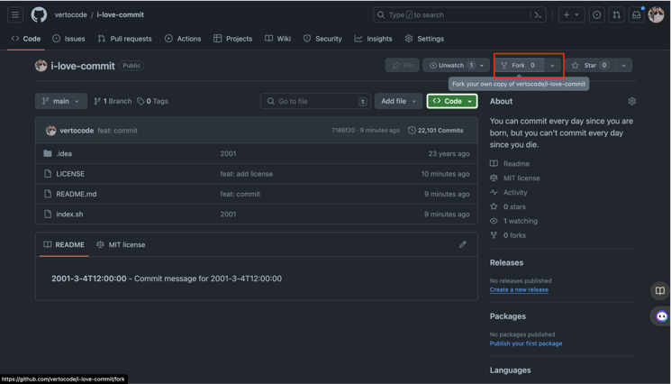

# i-love-commit

You can commit every day since you are born, but you can't commit every day since you die.

I was thinking, we can automate commands, right? So, why not automate commits? I did it for funny and it's available for your usage too.

## What it does?

This makes commits every day from 2001 to 2023. It's a bash script that made a simple change in the README.md and then commits it, and it repeats a lot of setting the date, 1 time per day.

## How to use?

First of all, fork this repository clicking on "Fork" button.



Then, clone your forked repository to your local machine.

```bash
git clone git@github.com:{your-username}/i-love-commit.git
```

Now, you can run the script.

```bash
cd i-love-commit
./commit.sh
```

After it will run for some time, you can optionally pass to the script a GitHub token to push automatically. If you don't pass clicking enter when it asks for the token, it will not push, but you can push then manually.

To push manually, you can run:

```bash
git push origin main
```

